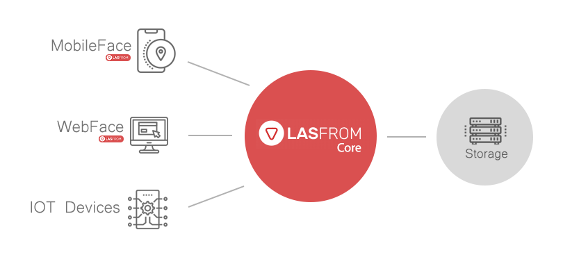

# Lasform

**A self-hosted, location-based platform** — an interactive map of locations and live-tracked
devices, geofencing, reviews, and role-based access control, wrapped in a Spring Boot API and an
Angular management console. Built to be reshaped for your own location-based product rather than
used as-is.

[](LICENSE)
[](core/pom.xml)
[](core/pom.xml)
[](web-face/package.json)
[](docker-compose.yml)



## Table of contents

- [Features](#features)
- [Tech stack](#tech-stack)
- [Project structure](#project-structure)
- [Getting started](#getting-started)
  - [Option A — Docker Compose (recommended)](#option-a--docker-compose-recommended)
  - [Option B — Run locally for development](#option-b--run-locally-for-development)
- [Configuration](#configuration)
- [API documentation](#api-documentation)
- [Testing](#testing)
- [Known limitations](#known-limitations)
- [Versioning](#versioning)
- [License](#license)
- [Authors](#authors)

## Features

- **Interactive map** — Leaflet or Google Maps, switchable per deployment at runtime (admin
  Settings, no rebuild) — with marker clustering, custom pins, and satellite/terrain/roadmap
  layers.
- **Locations** — named places with a GeoJSON point, address, photos, categories, and free-form
  tags; searchable by text, category, and tag.
- **Devices & live tracking** — register a device, push its position via a simple ingestion
  endpoint (raw JSON, [OGC SensorThings](https://www.ogc.org/standard/sensorthings/), or GeoJSON),
  and watch it move on the map in real time with a fading breadcrumb trail.
- **Geofences** — circular or polygon zones, drawn interactively on the map, with entry/exit
  alerts.
- **Reviews & moderation** — 1–5 star ratings with a pending → published/rejected moderation
  queue; a location's average rating is recalculated server-side, never trusted from the client.
- **Role-based access control** — five system roles (`SUPER_ADMIN`/`ADMIN`/`OPERATOR`/`VIEWER`/
  `ANONYMOUS`) resolving to atomic permission strings (`location:read`, `device:write`, ...);
  every authorization check is a permission check, never a role-name check.
- **JWT auth**, with optional **Google Sign-In**, self-registration (disabled until an admin
  approves), and a first-run setup wizard for the initial admin account.
- **Public, anonymous map view** — a subset of the map (and reviews) is viewable without logging
  in, gated by its own permission like everything else.
- **Admin-editable configuration** — map provider, feature flags, and SSO settings are stored in
  the database and changeable from the UI, not just environment variables.
- **i18n-ready** frontend (Transloco).

## Tech stack

| Layer | Technology |
|---|---|
| **Backend** | Java 21 · Spring Boot 4.1 (Web MVC, Security, Data MongoDB, Validation, Actuator) · JWT via [jjwt](https://github.com/jwtk/jjwt) · [springdoc-openapi](https://springdoc.org/) (OpenAPI 3 / Swagger UI) · Lombok · Maven |
| **Database** | MongoDB 7 — GeoJSON documents with 2dsphere indexes for all geo queries |
| **Frontend** | Angular 22 (standalone components, signals) · TypeScript · RxJS · [Leaflet](https://leafletjs.com/) + Leaflet.markercluster + Leaflet.draw, or Google Maps JS API + `@googlemaps/markerclusterer` — pluggable via a `MapProvider` abstraction · [Transloco](https://jsverse.github.io/transloco/) (i18n) · Vitest (unit tests) |
| **Mobile** | Native Android client (Kotlin, early stage) — see [`client/LasformAndroidClient`](client/LasformAndroidClient) |
| **Infra** | Docker + Docker Compose · single multi-stage `Dockerfile` — the Maven build's `with-frontend` profile compiles the Angular app and bundles it into the Spring Boot jar's `static/` folder, so one image/one port serves both the API and the UI |

## Project structure

```
Lasform/
├── core/                     Spring Boot backend — REST API, auth, business logic, and (once
│                              built with -P with-frontend) the bundled web UI
├── web-face/                 Angular frontend — management console + public map
├── client/LasformAndroidClient/  Native Android client (early stage)
├── scripts/                  Dev utilities — a GPS device simulator (see scripts/README.md)
├── documents/                Postman collection, architecture diagram
├── UIUX/                     Design source files
├── docker-compose.yml        MongoDB + app, one command
├── Dockerfile                Multi-stage build (Maven + Node → single runtime image)
└── DOCKER.md                 Docker-specific reference: env vars, volumes, backups, resource sizing
```

Each module has its own deeper README: [`core/README.md`](core/README.md) (authentication model,
reviews, device ingestion), [`web-face/README.md`](web-face/README.md) (Angular CLI basics),
[`scripts/README.md`](scripts/README.md) (the device simulator).

## Getting started

### Option A — Docker Compose (recommended)

The fastest way to get a working instance. Requires Docker and Docker Compose.

```bash
cp .env.example .env
```

Edit `.env` and set at least `LASFORM_JWT_SECRET` (generate one with `openssl rand -base64 48`) —
everything else has a working default or is optional.

```bash
docker compose up -d
```

Visit **http://localhost:8078**. On a fresh install you land on `/setup`, a short wizard that
creates the initial `SUPER_ADMIN` account and lets you optionally configure the map provider,
feature flags, and Google Sign-In. See [DOCKER.md](DOCKER.md) for the full environment variable
reference, volumes/backups, and resource sizing guidance.

### Option B — Run locally for development

**Prerequisites:** Java 21, Node.js 24.x + npm 12 (the exact versions the build pins), and a
running MongoDB 7 instance.

**1. MongoDB** — run one however's convenient, e.g.:

```bash
docker run -d --name lasform-mongo -p 27018:27017 mongo:7.0
```

`core/src/main/resources/application.yml` defaults to `mongodb://localhost:27018/lasform` —
port **27018**, deliberately not Mongo's default 27017, so a local dev instance doesn't collide
with a system-wide MongoDB already running on your machine. Override with the `SPRING_MONGODB_URI`
env var if you'd rather point it elsewhere.

**2. Backend** — from `core/`:

```bash
./mvnw spring-boot:run
```

Starts the API on **http://localhost:8078**. Without `LASFORM_JWT_SECRET` set, it falls back to a
random ephemeral signing key (logged as a warning) so this works with zero config — just know that
every token is invalidated on restart. See [`core/README.md`](core/README.md#config) for the full
config/env var table.

**3. Frontend** — from `web-face/`:

```bash
npm install
npm start
```

Serves the Angular dev server on **http://localhost:4200** with hot reload. It calls the API at
relative paths (`/api`, `/api/v1`), so proxy those to the backend — create `web-face/proxy.conf.json`:

```json
{ "/api": { "target": "http://localhost:8078", "secure": false, "changeOrigin": true } }
```

and run `ng serve --proxy-config proxy.conf.json` (or add `"proxyConfig": "proxy.conf.json"` under
the `serve` target in `angular.json` so plain `npm start` picks it up automatically).

**Alternative — single jar, no proxy needed:** build the frontend into the backend and run one
process, exactly like the Docker image does:

```bash
cd core && ./mvnw clean package -P with-frontend -DskipTests
java -jar target/lasform.jar
```

Serves everything on **http://localhost:8078**. Slower to iterate on frontend changes (no hot
reload — rebuild and restart), but simplest to run and closest to production.

**Simulating a moving device**, once the backend is up:

```bash
node scripts/simulate-device.js --device-id truck-42
```

Create a matching `Device` (with `deviceIdentifier: truck-42`) from the Devices management page
first, then open the map — its marker moves on every tick. See
[`scripts/README.md`](scripts/README.md) for all the options (custom start position, heading
behavior, interval, etc.).

## Configuration

Every setting is an environment variable with a working default, read directly by the app (Spring
Boot relaxed binding, e.g. `LASFORM_JWT_SECRET` ↔ `lasform.jwt.secret`) — `docker-compose.yml` just
forwards them through. The essentials:

| Variable | Required | Default | Notes |
|---|---|---|---|
| `LASFORM_JWT_SECRET` | **Yes** (Docker Compose refuses to start without it) | *(none)* | HMAC-SHA256 signing key, 32+ characters. |
| `LASFORM_ORG_NAME` | No | `Lasform` | Name of the single organization created on first run. |
| `LASFORM_ADMIN_EMAIL` / `LASFORM_ADMIN_PASSWORD` | No | *(blank)* | Bootstrap the initial `SUPER_ADMIN` on first boot. Leave both blank to use the `/setup` wizard instead. |
| `GOOGLE_MAPS_API_KEY` / `GOOGLE_SSO_CLIENT_ID` | No | *(blank)* | One-time seeds — configurable later from the admin UI either way. |
| `APP_PORT` | No | `8078` | Host port the app is published on (Docker Compose only). |

Full reference, including JWT TTLs, image storage limits, and every auth/config detail:
[DOCKER.md](DOCKER.md#environment-variables) and [`core/README.md`](core/README.md#config).

## API documentation

Interactive OpenAPI 3 docs are served by the running app itself:

- Swagger UI: `http://localhost:8078/swagger-ui.html`
- Raw OpenAPI spec: `http://localhost:8078/v3/api-docs`

A starter [Postman collection](documents/postman/Lasform.postman_collection.json) is also included.

## Testing

```bash
# Backend (JUnit)
cd core && ./mvnw test

# Frontend (Vitest)
cd web-face && npm test
```

## Known limitations

Documented transparently rather than silently assumed away — see
[`core/README.md`](core/README.md#known-gaps-not-built-yet) for details and rationale:

- Device event ingestion has no credential scheme yet — any caller can post events as any device.
- Refresh tokens aren't rotated on use.
- No admin API yet for creating custom roles or editing a role's permission bundle.
- Google Sign-In doesn't verify the access token's audience — fine for a single-frontend app, not
  yet safe as a shared backend for multiple untrusted clients.

## Versioning

Lasform is currently at `0.0.1-SNAPSHOT` — pre-1.0, breaking changes should be expected between
releases.

## License

Lasform is dual-licensed:

- **Noncommercial use** is free under the [PolyForm Noncommercial License 1.0.0](LICENSE).
- **Commercial use** — by a company, or any use where you need to keep your own integration code
  private without the noncommercial restriction — requires a paid
  [Lasform Commercial License](COMMERCIAL-LICENSE.md).

See [LICENSE](LICENSE) and [COMMERCIAL-LICENSE.md](COMMERCIAL-LICENSE.md) for full terms.

## Authors

- **Farzin Pashaee** — *Initial work* — [github.com/farzinpashaee](https://github.com/farzinpashaee/Lasform/)
